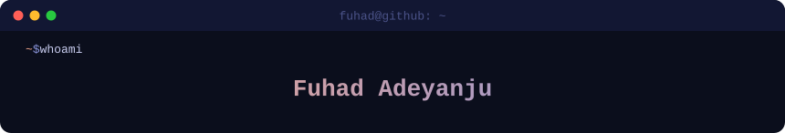

<p align="center">
  
</p>

<p align="center">
  
</p>

<p align="center">
  <a href="https://www.linkedin.com/in/fuhad-adeyanju"></a>
  <a href="https://x.com/AdeyanjuFuhad"></a>
  <a href="https://github.com/adeyanjufuhad"></a>
  
</p>

---

```js
const fuhad = {
  title:     "Fullstack Developer",
  education: "Computer Engineering @ OAU | Best Graduating Student — Nupat Technologies",
  stack: {
    frontend: ["React","Next Js","React Native", "Expo", "Tailwind CSS", "HTML/CSS"],
    backend:  ["Node.js", "Express", "Python", "FastAPI"],
    database: ["Supabase", "MongoDB"],
    tools:    ["Vercel", "Render", "Git"],
  },
  currentlyBuilding: "products that solve real problems — whether that's Lagos or London",
  openTo:            ["fulltime roles", "freelance", "contract", "collaboration"],
  funFact:           "I build projects worth standing on an international scale",
};
```

I build for **web and mobile**, and I take product quality personally. Whether it's a fintech app for savings groups or a real estate portal for a UK client, I bring the same energy — clean UI, solid architecture, and code that actually ships. I'm a Computer Engineering student at OAU, co-founder of two startups & Founder of Sova. If you need someone who can own a feature end-to-end and communicate clearly, that's me.

---

## 🚀 Projects

| Project | What it does | Status |
|--------|--------------|--------|
| **[CheckAm](https://github.com/adeyanjufuhad/CheckAm)** | Free scam checker for Nigerian messages, links and screenshots — in English and Pidgin | 🆕 New |
| **[AgroFinis](https://github.com/adeyanjufuhad/AgroFinis)** | Agtech platform connecting Nigerian agribusinesses to verified farmers, real-time commodity markets & AI agronomic advice | 🟢 Live |
| **[Luxe Estate](https://github.com/adeyanjufuhad/Luxe_Estate)** | Premium UK real estate web portal — property listings, search, and inquiry system built for a client | 🟢 Live |
| **[SOVA](https://github.com/adeyanjufuhad/Sova)** | Digitizing Ajo/Esusu/Adashe rotating savings groups — automated payouts, Sova Score, QR group joining | 🔨 In Dev |
| **[Kredia](https://github.com/adeyanjufuhad/Kredia)** | Campus intelligence platform — past questions AI, live power-spot map, and a skill-trade credit system | 🔨 In Dev |
| **[portfolio](https://github.com/adeyanjufuhad/portfolio)** | Personal portfolio site | ✅ Shipped |

---

## 🛠 Tech Stack

<p align="center">
  <a href="https://skillicons.dev">
    
  </a>
</p>

---

## 📊 GitHub Stats

<p align="center">
  
  
</p>

<p align="center">
  
</p>

---

## 💡 Philosophy

<p align="center"><i>I write code that ships, not code that sits in branches forever.</i></p>

<p align="center">
  
  
  
  
  
</p>

---

<p align="center">
  
</p>
